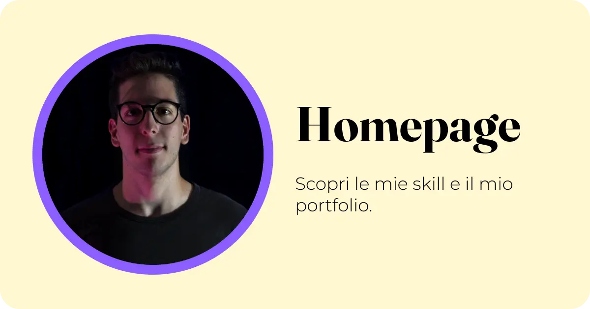

# Davide Cavallucci | Personal Portfolio Website

**L'intersezione tra Design centrato sull'utente e Sviluppo Software.**

[🌐 Live Demo](https://davidecavallucci.github.io/Personal-Website/) &nbsp;&nbsp;•&nbsp;&nbsp; [🎓 Start2Impact](https://www.start2impact.it/) &nbsp;&nbsp;•&nbsp;&nbsp; [💼 LinkedIn](https://www.linkedin.com/in/davide-cavallucci) &nbsp;&nbsp;•&nbsp;&nbsp; [✉️ Contattami](https://davidecavallucci.github.io/Personal-Website/pagine/contatti.html)

---

## 🎯 Panoramica del Progetto
Questo repository ospita il codice sorgente del mio portfolio personale, nato come progetto pratico per il Master in UX/UI Design di **Start2Impact** e in continua evoluzione. 

### Obiettivi chiave:
1. **Mostrare la padronanza tecnica:** Scrittura di codice semantico, architettura CSS modulare e logica JavaScript fluida.
2. **Raccontare il mio processo (Case Studies):** Ospitare i miei progetti di design, lavoro, coding o divertimento, illustrando non solo il risultato finale con tanto di repo pubblica e visualizzabile.
3. **Condividere il mio background:** Unire la mia esperienza accademica in Informatica e la disciplina derivata dal Coaching Sportivo nella Pallanuoto.

---

## ✨ Features "Under the Hood"
Il sito è stato progettato pensando alle performance e all'usabilità, implementando logiche avanzate senza l'uso di framework JavaScript pesanti:

- 🌗 **Dark/Light Mode Dinamica:** Gestione dei temi tramite variabili CSS (SCSS) con focus assoluto sull'accessibilità e sui contrasti cromatici.
- 🧩 **Vanilla JS Web Components:** Header e Footer ingegnerizzati come componenti riutilizzabili per un codice DRY (Don't Repeat Yourself).
- 🗄️ **Data-Driven UI:** Renderizzazione dinamica della sezione Progetti e del CV partendo da file JSON/JS strutturati (separazione tra Dati e Struttura).
- 📱 **Mobile First & Glassmorphism:** Interfaccia responsiva con effetti traslucidi ottimizzati per la massima leggibilità in ogni contesto.
- ⚡ **Micro-interazioni Premium:** Scroll progress bar con accelerazione hardware (GPU), page transitions fluide e easter egg per veri nerd come me.

---

## 🛠️ Stack Tecnologico

  

---

## 📸 Sneak Peek

  

---

## 🤝 Let's Connect!
Hai un progetto in mente o vuoi scambiare due chiacchiere su UX, codice o pallanuoto? Non esitare a scrivermi.

   
  
Progettato e sviluppato con 💜 da Davide Cavallucci

